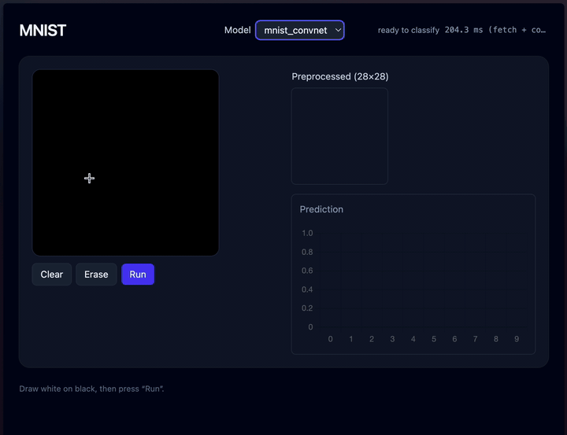

# MNIST WebGPU Classifier



 **[Live Demo (GitHub Pages)](https://mailittlepony.github.io/mnist/)**

---

## Overview

This project combines **TinyGrad** and **WebGPU** to train and deploy handwritten-digit classifiers entirely in the browser.  
It includes both **training scripts (Python)** for MLP and CNN models, and a **WebGPU app** where you can draw digits, switch models, and visualize real-time predictions.

The goal was to explore **hyperparameter optimization** and **on-device inference** using efficient GPU minimal deep learning frameworks like *TinyGrad* from training to web deployment.

---

## Features

- **Model selection** — easily switch between **MLP** and **CNN**  
- **Drawing canvas** — draw digits with pen, eraser, and clear tools  
- **Real-time classification**  
- **Probability bar chart** — softmax visualization of all 10 digits (0–9)  
- **WebGPU acceleration** — inference runs directly on GPU  
- **Training & evaluation tools** — scripts for local experiments and plotting  
- **Hyperparameter exploration** — you can follow my trianing strategies in **[hyperparameters.md](./docs/hyperparameters.md)**


---

## Model Summary

| Model | Architecture | Accuracy | Activation | Optimizer | Batch size | Steps | LR max |
|--------|---------------|-----------|-------------|------------|-------------|------------|------------|
| **MLP** | width=512, depth=2 | **98.6 %** | SiLU | AdamW | 256 | 5000 |0.0009804|
| **CNN** | 4 conv | **99.3 %** | ReLU | AdamW | 128 | 5000 |0.0005426|

Both models were trained on MNIST using **cosine-annealing** learning-rate scheduling.

---

## Setup / Local Run

You first need to install `dawn` for webgpu:
```bash
brew tap wpmed92/dawn && brew install dawn
```

and **[tinygrad](https://github.com/tinygrad/tinygrad)**:
```bash
git clone https://github.com/tinygrad/tinygrad.git
cd tinygrad
python3 -m pip install -e .
```

### 1. Clone & install
```bash
git clone https://github.com/mailittlepony/mnist.git
cd mnist
```

### 2. Train models
Run any of the following to train locally:
```bash
cd train

# Train MLP
python mnist_mlp.py

# Train CNN
python mnist_convnet.py

# Both can take parameters
STEPS=5000 BATCH=256 LR_MAX=0.0009804 ACT=silu OPT=adamw python mnist_mlp.py

# Run N experiments defined in the script
python run_experiments.py
```

### 3. Plot results
```bash
# Plot any of the csv
python plot.py mnist_mlp_trainlog.csv
```
---

## Hyperparameter Log

See detailed exploration and tuning results here:  
 **[hyperparameters.md](./docs/hyperparameters.md)**

---


### Results Summary

| Phase | Best MLP Acc | Best CNN Acc | Notes |
|-------|---------------|--------------|--------|
| Initial | 87.36 % | 97.96 % | Base configs |
| Tuned | **98.6 %** | **99.34 %** | AdamW + cosine LR |
| WebGPU | realtime | realtime | Stable inference at 60 FPS |


