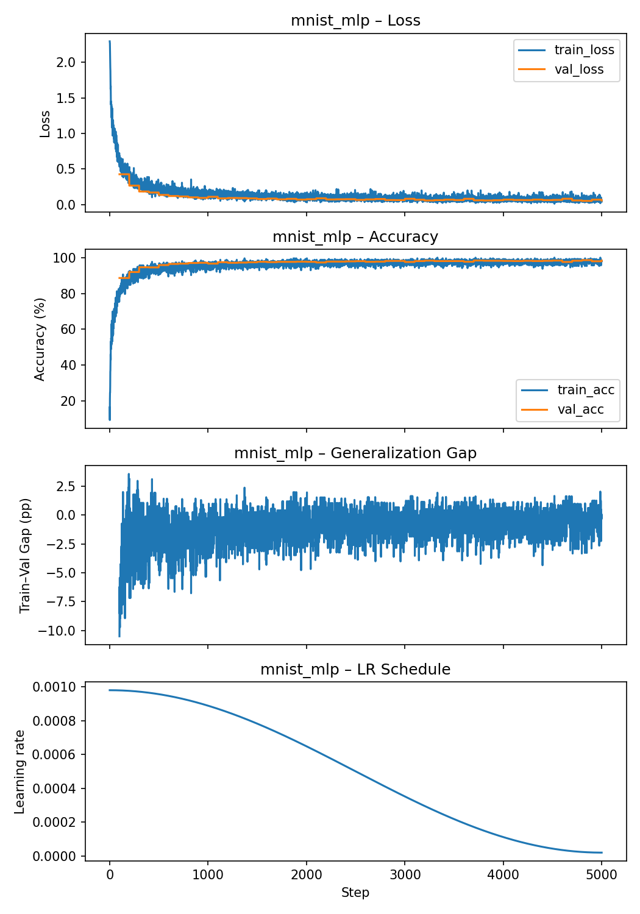
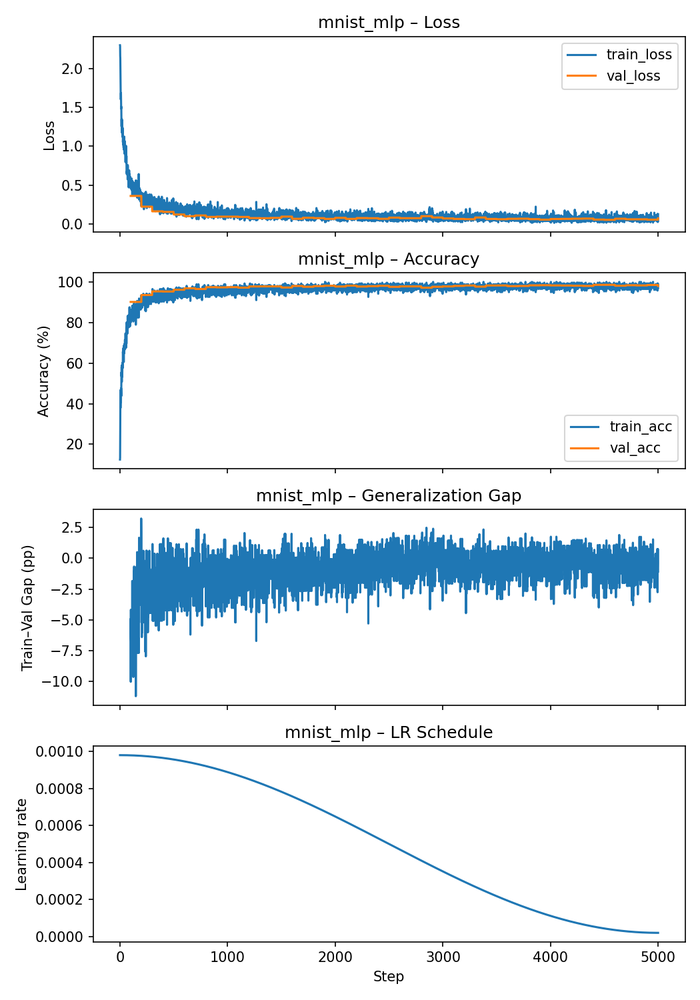
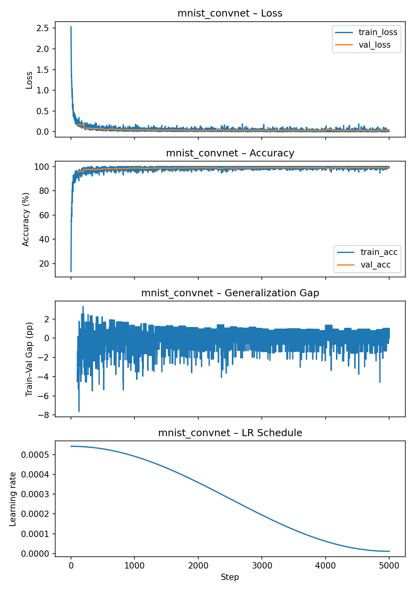
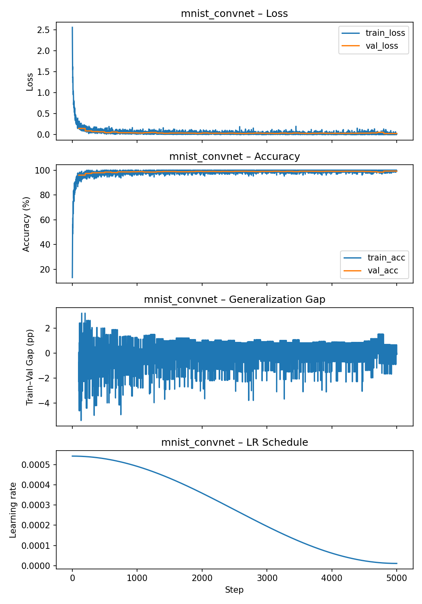

# Hyperparameters Analysis & Training Exploration

## Initial Run

| Model | Learning Rate | Loss | Accuracy |
|--------|----------------|------|-----------|
| **mnist_mlp** | 2.00e-02 | 0.51 | 87.36 % |
| **mnist_covnet** | 2.00e-02 | 0.11 | 97.96 % |

---

## Strategy

**Goal:** explore the main hyperparameters for MNIST classification (MLP and CNN) and identify the best configurations.

### Research notes
- Feasible and reasonable **batch sizes**: `64`, `128`, `256`
- Reasonable **network depth**: 2–3 hidden layers for this complexity is more than enough
- **Uniform layer width** (same number of neurons per hidden layer) is simple and effective and I prefer starting simple and adjusting later if needed.
- Common **optimizers**: `AdamW`, `SGD + momentum`
- Chosen **activations**: `SiLU`, `ReLU` rather than `tanh` or `sigmoid` due to how they flatten and the gradient could be near 0 and intuitively I don't see why we would want that for our training. However I might be wrong and this could also be some tweaks to make in case of bad results.
- **Learning rate** strategy: looking at the "basic" cost function behaviour compared to the network weights I was thinking of starting high, then smoothly decreasing as we maybe come toward a minimum of the cost function. For this I found **cosine-anneal**.

### Approach
Test ≈ 10 random combinations of  
→ batch size, optimizer, activation function, and initial learning rate (lr_max)
for both MLP and CNN.  
Each configuration is trained automatically and the test accuracy is logged to identify the best setup.
Later on we will also test 2 other hyperparameters: weight decay and the width of the network.

---

## First Results

| Model | Batch | Optimizer | LR | Activation | Accuracy |
|--------|-------|------------|------|-------------|-----------|
| MLP | 256 | SGD | 0.1524 | SiLU | 95.89 % |
| MLP | 256 | SGD | 0.07641 | ReLU | 97.71 % |
| MLP | 256 | AdamW | 0.0009804 | SiLU | **98.07 %** |
| MLP | 128 | SGD | 0.04633 | SiLU | 97.52 % |
| MLP | 128 | AdamW | 0.0006333 | SiLU | 97.60 % |
| MLP | 128 | AdamW | 0.001393 | SiLU | 97.25 % |
| MLP | 128 | SGD | 0.08061 | SiLU | 96.10 % |
| MLP | 128 | AdamW | 0.001622 | SiLU | 96.95 % |
| MLP | 256 | SGD | 0.0733 | SiLU | 97.99 % |
| MLP | 128 | SGD | 0.06 | SiLU | 97.17 % |
| CNN | 128 | AdamW | 0.0007185 | SiLU | 99.25 % |
| CNN | 128 | AdamW | 0.0005426 | ReLU | **99.31 %** |
| CNN | 256 | SGD | 0.0995 | SiLU | 99.19 % |
| CNN | 256 | SGD | 0.197 | ReLU | 98.95 % |
| CNN | 128 | AdamW | 0.000372 | ReLU | 99.05 % |
| CNN | 256 | SGD | 0.1672 | ReLU | 99.08 % |
| CNN | 256 | AdamW | 0.001835 | ReLU | 99.21 % |
| CNN | 256 | AdamW | 0.000478 | SiLU | 99.19 % |
| CNN | 256 | AdamW | 0.002715 | ReLU | 99.19 % |
| CNN | 128 | SGD | 0.1231 | SiLU | 98.86 % |

**Best configurations**
- **MLP:** `BATCH=256`, `OPT=AdamW`, `LR=0.0009804`, `ACT=SiLU` → **98.07 %**
- **CNN:** `BATCH=128`, `OPT=AdamW`, `LR=0.0005426`, `ACT=ReLU` → **99.31 %**

---

## Second-Phase Experiments

Now that I found good combinations I will now try to improve them by plotting their behaviour and try to interpret where they need improvement.
### MLP

**Command**
```bash
STEPS=5000 BATCH=256 LR_MAX=0.0009804 ACT=silu python mnist_mlp.py
```

**Result**
```bash
lr: 1.96e-05  loss: 0.04  acc: 98.60 %
```



### **Observations**
- **Loss:** Train and validation losses drop quickly then plateau together → stable, no overfitting.  
- **Accuracy:** Both reach ≈ 98.6 %, overlap closely.  
- **Gap:** ≈ 0-3 pp; occasionally val > train → fine.  
- **LR schedule:** Smooth cosine decay (≈ 0.001 → 0.00002), works perfectly.

---
So fortunately and unfortunately for our experiments the results are pretty good so I don't really know what to tweak to improve it more but for the sake of exploring I tried with more neurons (before 512):

**Command:**  
```bash
STEPS=5000 BATCH=256 LR_MAX=0.0009804 ACT=silu WIDTH=768 python mnist_mlp.py  
```

**Result:**  
```bash
lr: 1.96e-05 loss: 0.12 acc: 98.54 %
```



### **Conclusion**
- Accuracy unchanged (≈ 98.6 %) but training time increased.  
  - 768 neurons → 230 ms  
  - 512 neurons → 39 ms  
- Larger width adds cost without benefit on MNIST.

---

## CNN

**Command:**  
```bash
STEPS=5000 BATCH=128 LR_MAX=0.0005426 ACT=relu python mnist_convnet.py  
```

**Result:**  
```bash
lr: 1.09e-05 loss: 0.03 acc: 99.25 %
```



### **Observations**
- **Loss:** Train ≈ val → no divergence → no overfitting or underfitting
- **Accuracy:** Both reach ≈ 99 %, perfectly aligned.  
- **Gap:** ~0 ± 2 pp → no overfitting.  
- **LR schedule:** Cosine decay functions as intended.

---
Again fortunately and unfortunately for our experiments the results are pretty good so I just wanted to play around with the weight decay to see if we could acheive even better generalization (based on its formula):

**Command:**  
```bash
STEPS=5000 BATCH=128 LR_MAX=0.0005426 ACT=relu WD=1e-4 python mnist_convnet.py  
```

**Result:**  
```bash
lr: 1.09e-05 loss: 0.02 acc: 99.34 %
```



### **Conclusion**
- Curves remain identical; accuracy slightly improved.  
- Training speed unaffected.  

So I could go on and see to what extent the weight decay can improve the accuracy but I am already satisfied with the current accuracy.
I still tried another configuration which is the same but with just a bigger batch size (256) because I thought it wouldn't do any wrong except from slowing a tiny bit the learning but the results gave the same accuracy more or less.

---

## Final Remarks
- Both models exceeded my accuracy targets:  
  - **MLP:** ≈ 98.60 %  
  - **CNN:** ≈ 99.34 %  
- **Cosine LR schedule**, **AdamW optimizer**, and **other augmentations** provide stable convergence.  
- Further tweaks (width, depth, dropout, or stronger weight decay) bring negligible benefit.  
- Current configurations are **satisfactory for MNIST**.


